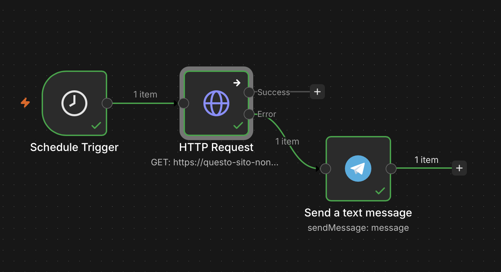
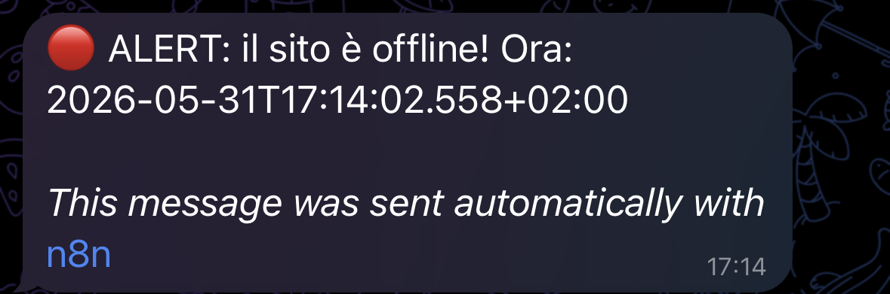

   

# 🟢 Monitor Uptime Sito Web (Versione Italiana)

> Workflow n8n che controlla ogni 5 minuti se un sito web è online e invia immediatamente un alert su Telegram in caso di downtime. Zero dipendenze esterne - n8n fa tutto da solo.

---

## 📸 Screenshot


*Il workflow su n8n: Schedule Trigger -> HTTP Request -> Alert Telegram (solo se offline)*


---

## ⚡ Come funziona

1. **Schedule Trigger** - Si avvia ogni 5 minuti tramite espressione cron `*/5 * * * *`
2. **HTTP Request** - Fa una richiesta GET al sito da monitorare. Il nodo è configurato con `Continue On Fail` attivo: se il sito è irraggiungibile il workflow continua invece di bloccarsi
3. **Telegram** - Riceve i dati solo sul ramo di errore (quando il sito è offline) e invia subito un alert con l'orario esatto del downtime

**Esempio alert ricevuto:**
```
🔴 ALERT: il sito è offline! Ora: 2025-05-31T14:23:07.000Z
```

---

## 🛠️ Stack & Integrazioni

| Tool | Uso |
|------|-----|
| n8n | Orchestrazione del workflow |
| HTTP Request | Ping al sito da monitorare |
| Telegram Bot API | Invio alert in caso di downtime |

---

## 🚀 Come importare questo workflow

1. Scarica `Monitor Uptime.json` da questo repo
2. Apri n8n (cloud su [n8n.cloud](https://n8n.cloud) oppure self-hosted)
3. Vai su **Workflows -> Import from file**
4. Carica il file JSON
5. Configura l'URL del sito e le credenziali Telegram (vedi sezione sotto)
6. Clicca **Save** poi **Activate**

---

## 🔧 Configurazione

### 1. URL del sito da monitorare

Nel nodo **HTTP Request**, sostituisci il placeholder con il sito reale:

```
[URL_SITO_DA_MONITORARE] -> https://tuosito.com
```

### 2. Bot Telegram

Nel nodo **Telegram**, inserisci:
- **Credenziali**: crea una nuova credenziale Telegram con il token del tuo bot (ottienilo da [@BotFather](https://t.me/BotFather) -> `/newbot`)
- **Chat ID**: il tuo ID numerico (trovalo aprendo `https://api.telegram.org/bot[TOKEN]/getUpdates` dopo aver scritto al bot)

### 3. Frequenza di controllo (opzionale)

Di default il controllo avviene ogni 5 minuti (`*/5 * * * *`). Puoi cambiarlo nel nodo **Schedule Trigger**:

| Frequenza | Espressione cron |
|-----------|-----------------|
| Ogni 5 minuti | `*/5 * * * *` |
| Ogni 10 minuti | `*/10 * * * *` |
| Ogni ora | `0 * * * *` |

---

## 🔑 Credenziali necessarie

| Servizio | Come ottenerla |
|----------|----------------|
| Telegram Bot Token | [@BotFather](https://t.me/BotFather) su Telegram -> `/newbot` -> copia il token |
| Telegram Chat ID | Scrivi al bot, poi apri `https://api.telegram.org/bot[TOKEN]/getUpdates` e cerca `"id"` dentro `"chat"` |

> Nessuna API key esterna richiesta. L'unica integrazione è Telegram.

---

## 📁 Struttura repo

```
.
├── README.md
├── Monitor Uptime.json        # Workflow esportato da n8n
└── screenshots/
    ├── workflow.png           # Screenshot del canvas n8n
    └── Alert.png              # Screenshot del messaggio su Telegram
```

---

## 📄 Licenza

MIT License - libero di usarlo, modificarlo e condividerlo.  
Vedi il file [LICENSE](LICENSE) per il testo completo.

---

# 🟢 Website Uptime Monitor (English version)

> n8n workflow that checks every 5 minutes whether a website is online and immediately sends a Telegram alert in case of downtime. No external dependencies - n8n handles everything on its own.

---

## 📸 Screenshot


*The n8n workflow: Schedule Trigger -> HTTP Request -> Telegram Alert (only if offline)*


---

## ⚡ How it works

1. **Schedule Trigger** - Runs every 5 minutes using the cron expression `*/5 * * * *`
2. **HTTP Request** - Sends a GET request to the monitored site. The node is configured with `Continue On Fail` enabled: if the site is unreachable the workflow continues instead of stopping
3. **Telegram** - Receives data only on the error branch (when the site is offline) and immediately sends an alert with the exact downtime timestamp

**Example alert received:**
```
🔴 ALERT: the site is offline! Time: 2025-05-31T14:23:07.000Z
```

---

## 🛠️ Stack & Integrations

| Tool | Use |
|------|-----|
| n8n | Workflow orchestration |
| HTTP Request | Ping to the monitored site |
| Telegram Bot API | Alert delivery on downtime |

---

## 🚀 How to import this workflow

1. Download `Monitor Uptime.json` from this repo
2. Open n8n (cloud at [n8n.cloud](https://n8n.cloud) or self-hosted)
3. Go to **Workflows -> Import from file**
4. Load the JSON file
5. Configure the site URL and Telegram credentials (see section below)
6. Click **Save** then **Activate**

---

## 🔧 Configuration

### 1. URL of the site to monitor

In the **HTTP Request** node, replace the placeholder with the real site:

```
[URL_SITO_DA_MONITORARE] -> https://yoursite.com
```

### 2. Telegram Bot

In the **Telegram** node, fill in:
- **Credentials**: create a new Telegram credential with your bot token (get it from [@BotFather](https://t.me/BotFather) -> `/newbot`)
- **Chat ID**: your numeric ID (find it by opening `https://api.telegram.org/bot[TOKEN]/getUpdates` after sending a message to your bot)

### 3. Check frequency (optional)

By default the check runs every 5 minutes (`*/5 * * * *`). You can change it in the **Schedule Trigger** node:

| Frequency | Cron expression |
|-----------|----------------|
| Every 5 minutes | `*/5 * * * *` |
| Every 10 minutes | `*/10 * * * *` |
| Every hour | `0 * * * *` |

---

## 🔑 Required credentials

| Service | How to get it |
|---------|---------------|
| Telegram Bot Token | [@BotFather](https://t.me/BotFather) on Telegram -> `/newbot` -> copy the token |
| Telegram Chat ID | Message the bot, then open `https://api.telegram.org/bot[TOKEN]/getUpdates` and look for `"id"` inside `"chat"` |

> No external API key required. The only integration is Telegram.

---

## 📁 Repo structure

```
.
├── README.md
├── Monitor Uptime.json        # Workflow exported from n8n
└── screenshots/
    ├── workflow.png           # Screenshot of the n8n canvas
    └── Alert.png              # Screenshot of the Telegram alert
```

---

## 📄 License

MIT License - free to use, modify and share.  
See the [LICENSE](LICENSE) file for the full text.

---
